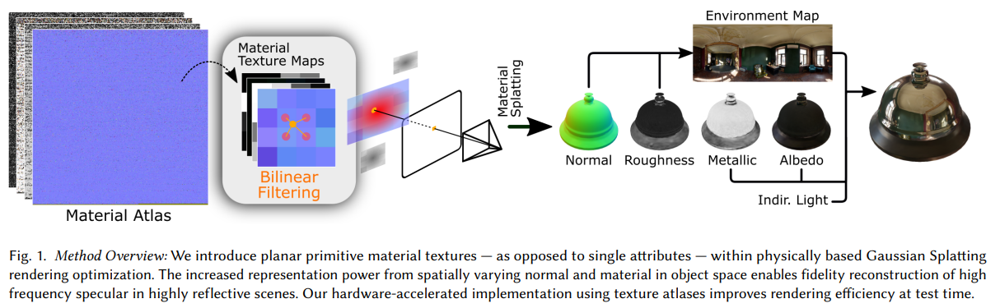
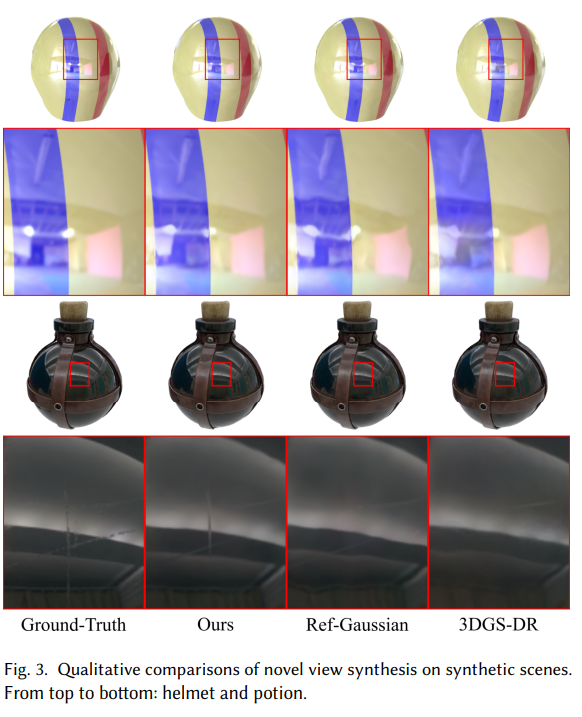
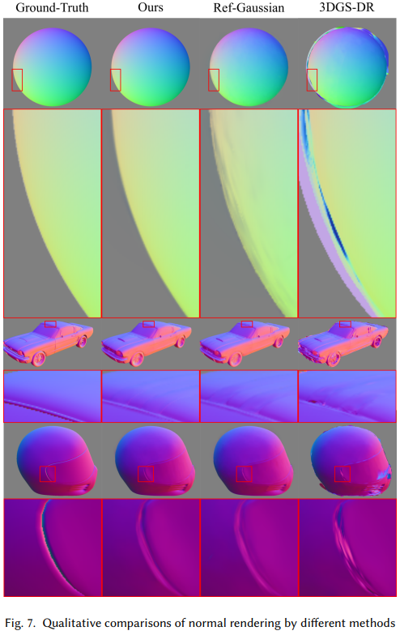

# TextureSplat
## TextureSplat: Per-Primitive Texture Mapping for Reflective Gaussian Splatting

This repository will soon contain the implementation of TextureSplat, a method that improves inverse rendering for complex reflective scenes by enhancing Gaussian Splatting with spatially variable materials and GPU-accelerated texture atlases, enabling high-fidelity radiance fields via geometrically grounded primitives.

# [Project (Soon)](https://github.com/maeyounes/TextureSplat) | [Paper](https://arxiv.org/abs/2506.13348)

