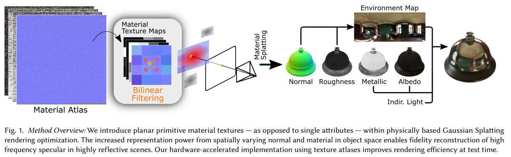
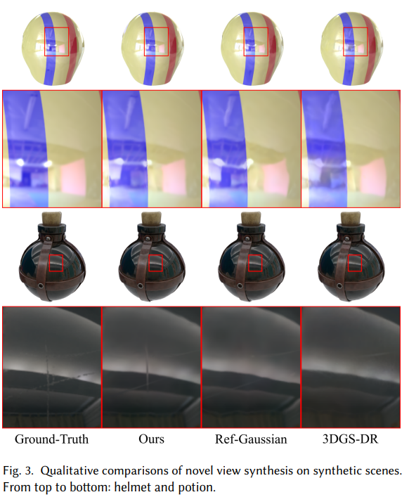
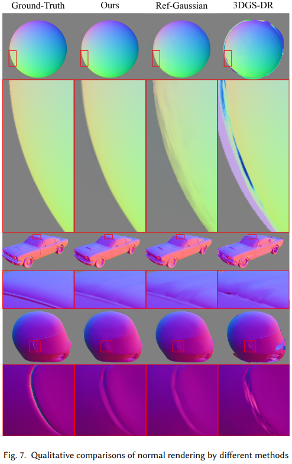

<div align="center">

# TextureSplat: Per-Primitive Texture Mapping for Reflective Gaussian Splatting

### **3DV 2026**

[**Mae Younes**](https://maeyounes.github.io/) &nbsp;·&nbsp; [**Adnane Boukhayma**](https://boukhayma.github.io/)

*Inria, France*

[](https://arxiv.org/abs/2506.13348)
[](https://github.com/maeyounes/TextureSplat)

<br/>



</div>

<br/>

TextureSplat extends 2D Gaussian Splatting for inverse rendering of highly
reflective scenes. Instead of storing a single material attribute per Gaussian, we
attach a small texture map to each primitive for
**albedo**, **metallic**, **roughness**, and a **tangent-space normal map**.
The 2D Gaussian's local `(u, v)` parameterisation gives us texture
coordinates at the ray–splat intersection, so high-frequency surface detail
and detailed normals are recovered **without growing the primitive count**. This work can also benefit 3DGS-based inverse rendering methods with spatially varying material attributes.

At test time the per-primitive textures are packed into a CUDA texture-object
atlas and sampled with hardware bilinear filtering (`tex2D`) for a
non-trivial speedup over the software path used during training.

<div align="center">
  
  
</div>


## Method at a glance

<div align="center">
  
</div>

The training pipeline runs in **four stages** using `train.py`:

| Stage | Iter range (defaults) | Renderer | What is optimised |
|:--|:--|:--|:--|
| 1. Init | `0 .. init_until_iter` (0) | `render_initial` | Geometry only, SH radiance |
| 2. Volume PBR | `.. volume_render_until_iter` (18 k) | `render_volume` | Forward shading with material attributes |
| 3. Deferred PBR (baseline) | `.. texture_from_iter` (30 k) | `render_surfel` | Deferred shading, scalar per-primitive material attributes |
| 4. **Textured deferred PBR** | `.. iterations` (60 k) | `render_surfel_textured` | Per-primitive texture maps, **positions frozen** |

Inter-reflection visibility is approximated by ray-tracing an extracted
mesh and indirect lighting is encoded with per-splat SH.

Stage 4 is the TextureSplat contribution: per-primitive material/normal
textures are sampled at the ray–splat intersection, splatted to G-buffers,
and shaded with a split-sum IBL term against a learnable environment
map.

Stages 1–3 reproduce Ref-Gaussian; running with `--texture_from_iter` set
beyond `--iterations` therefore yields a pure baseline run.


## Installation

The build requires **CUDA 12.1**, **gcc 12**, **PyTorch 2.4 (cu121)**.

> Tested on Linux x86_64 with an NVIDIA driver supporting CUDA 12.1 (RTX A6000).

```bash
# 1. Clone with submodules
git clone --recursive https://github.com/maeyounes/TextureSplat.git
cd TextureSplat

# 2. Create the env
conda create -y -n texturesplat python=3.8
conda activate texturesplat

# 3. CUDA 12.1 toolkit (incl. libcuda.so stub for linking) from the NVIDIA channel.
conda install -y -c "nvidia/label/cuda-12.1.1" cuda

# 4. gcc/g++ 12 from conda-forge and Eigen (needed by submodules/raytracing).
conda install -y -c conda-forge gcc_linux-64=12 gxx_linux-64=12 libxcrypt eigen=3.4

# 5. Pin CUDA_HOME + the linker's stub-lib search path. The nvidia/cuda
#    metapackage installs the libcuda link stub at $CONDA_PREFIX/lib/stubs/
#    (kept off the default load path on purpose so the real driver libcuda.so.1
#    wins at runtime), so the linker needs an explicit hint via LIBRARY_PATH.
mkdir -p "$CONDA_PREFIX/etc/conda/activate.d"
cat > "$CONDA_PREFIX/etc/conda/activate.d/cuda.sh" <<'EOF'
export CUDA_HOME="$CONDA_PREFIX"
export PATH="$CONDA_PREFIX/bin:$PATH"
export LIBRARY_PATH="$CONDA_PREFIX/lib/stubs:${LIBRARY_PATH:-}"
EOF

# 6. Re-activate so the new activation scripts are picked up.
conda deactivate && conda activate texturesplat

# 7. PyTorch 2.4.1 (CUDA 12.1 build).
pip install torch==2.4.1 torchvision==0.19.1 --index-url https://download.pytorch.org/whl/cu121

# 8. Python dependencies.
pip install numpy==1.24.4 scipy plyfile trimesh==4.3.2 \
            open3d==0.18.0 opencv-python==4.10.0.84 \
            kornia==0.7.3 scikit-image imageio==2.35.1 mediapy==1.2.2 \
            matplotlib==3.7.5 Pillow dearpygui==1.11.1 \
            tqdm==4.66.2 tensorboard
pip install https://github.com/NVlabs/nvdiffrast/archive/v0.3.1.tar.gz

# 9. Build the four CUDA extensions in-tree.
pip install --no-build-isolation submodules/diff-surfel-rasterization
pip install --no-build-isolation submodules/simple-knn
pip install --no-build-isolation submodules/raytracing
pip install --no-build-isolation submodules/cubemapencoder
```

Notes:
- `submodules/raytracing` picks up the conda-installed Eigen 3.4 headers
  automatically (its `setup.py` searches `$CONDA_PREFIX/include/eigen3`). If
  none is found it falls back to downloading Eigen 3.3.7 into the submodule
  directory.
- The first training step JIT-builds nvdiffrast's `renderutils_plugin`, which
  links `-lcuda` and `-lnvrtc`. The link-time stubs live in
  `$CONDA_PREFIX/lib/stubs/` and the step-5 activation script puts that
  directory on `LIBRARY_PATH`, so no system driver `libcuda.so` is required to
  build. At runtime the binary resolves `libcuda.so.1` against the host
  NVIDIA driver via the standard system loader paths.


## Datasets

We evaluate on the same four benchmarks as Ref-Gaussian:

| Dataset | Source | Layout expected by the code |
|---|---|---|
| Shiny Blender (Synthetic) | https://storage.googleapis.com/gresearch/refraw360/ref.zip | `data/ref_nerf/<scene>/` |
| Shiny Blender (Real)      | https://storage.googleapis.com/gresearch/refraw360/ref_real.zip | `data/ref_real/<scene>/` |
| Glossy Synthetic          | https://liuyuan-pal.github.io/NeRO/ | `data/GlossySynthetic/<scene>_blender/` (after conversion) |
| NeRF Synthetic            | [drive link](https://drive.google.com/drive/folders/1cK3UDIJqKAAm7zyrxRYVFJ0BRMgrwhh4) | `data/nerf_synthetic/<scene>/` |

Glossy Synthetic ships in NeRO's format and must be converted to a
Blender-style transforms JSON layout:

```bash
for scene in angel bell cat horse luyu potion tbell teapot; do
    python nero2blender.py --path data/GlossySynthetic --scene $scene
done
```


## Training

A single `train.py` run performs all four stages. The defaults below are set
in `arguments/__init__.py`:

| Flag | Default | Meaning |
|---|---|---|
| `-s` / `--source_path` | — | Scene directory (e.g. `data/ref_nerf/ball`) |
| `--model_path` | auto | Output directory (auto-named under `output/` if omitted) |
| `--iterations` | 60000 | Total iterations across all stages |
| `--init_until_iter` | 0 | End of stage 1 |
| `--volume_render_until_iter` | 18000 | End of stage 2 |
| `--texture_from_iter` | 30000 | Start of stage 4 (textured deferred PBR) |
| `--texture_size` | 4 | Per-primitive texture resolution (default 4x4) |
| `--lambda_normal_smooth` | 0.0 | Normal-map smoothness weight |
| `--white_background` | False | Required for synthetic datasets |
| `--eval` | False | Hold out a test split |

Per-dataset scripts are provided:

```bash
sh train_shiny.sh    # Shiny Blender (synthetic)
sh train_glossy.sh   # Glossy Synthetic
sh train_real.sh     # Ref-Real
```

#### Pure baseline run (no textures)

```bash
python train.py -s data/ref_nerf/ball --eval --white_background \
    --texture_from_iter 100000     # never enters stage 4
```


## Evaluation

```bash
python eval.py --model_path output/<scene>/<run> --white_background --save_images
```

`eval.py` inspects the saved `.ply` (`tex_n_*` attribute count) and picks
the right model class and renderer automatically — the same command works
for baseline and textured runs. Reports PSNR / SSIM / LPIPS / FPS into
`<model_path>/metric.txt`.

Other useful flags:

| Flag | Effect |
|---|---|
| `--iteration N` | Pick a specific iteration (default: latest in `point_cloud/`) |
| `--use_hw_sampling` | Use the hardware atlas + `tex2D` bilinear path (textured runs only) |
| `--eval_normals` | Compute mean angular error against GT `*_normal.png` |
| `--save_images` | Dump per-view RGB + normal PNGs under `<model_path>/test/renders/` |

### Software vs hardware texture sampling

Training uses a software bilinear sampler (deterministic gradients).
At test time `--use_hw_sampling` builds a `cudaTextureObject_t` atlas of the
per-primitive textures and reads it with `tex2D`. The two paths produce
visually identical renders with a tiny numerical drift and the HW path is several percent faster.

## Citation

If you find this repo useful, please cite our work:
```bibtex
@article{younes2025texturesplat,
  title={TextureSplat: Per-Primitive Texture Mapping for Reflective Gaussian Splatting},
  author={Younes, Mae and Boukhayma, Adnane},
  journal={arXiv preprint arXiv:2506.13348},
  year={2025}
}
```


## Acknowledgements

This codebase is built on top of [Ref-Gaussian](https://github.com/fudan-zvg/ref-gaussian). 

It also builds on prior work:

- [3DGS-DR](https://github.com/gapszju/3DGS-DR) — deferred reflective shading
- [2D Gaussian Splatting](https://github.com/hbb1/2d-gaussian-splatting) — planar gaussian primitives
- [Raytracing](https://github.com/ashawkey/raytracing) — mesh ray-tracing for visibility
- [nvdiffrast](https://github.com/NVlabs/nvdiffrast) — PBR shading utilities for IBL


## License

Released under the Gaussian-Splatting research license (see
[`LICENSE.md`](LICENSE.md)) — non-commercial research and evaluation only.
